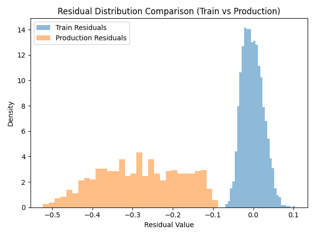

# 🏭 Industrial ML Efficiency – Drift-Aware Regression System

## 📌 Overview

This project simulates a real-world industrial machine learning system where a regression model predicts process efficiency based on operational variables.

The focus is not only model performance — but production robustness.

It demonstrates how a model can silently fail due to **concept drift**, even when feature distributions remain stable.

---

## 🎯 Objective

Predict industrial process efficiency using:

- Temperature
- Pressure
- Flow
- Composition

Then simulate a structural change in the system and evaluate how the model behaves in production.

---

## 🧠 Key Concepts Demonstrated

- Supervised regression with XGBoost
- Temporal train/validation/test split
- Overfitting detection
- Feature drift detection (KS + PSI)
- Concept drift detection
- Residual monitoring
- Production-aware evaluation

---

## 🏗 Project Structure

industrial-mlops-efficiency/
│
├── data/
├── models/
├── reports/
│ └── residual_drift_visualization.png
│
├── src/
│ ├── generate_data.py
│ ├── train.py
│ ├── drift_analysis.py
│ └── residual_drift.py
│
├── requirements.txt
└── README.md

---

## 📊 Phase 1 — Stable Model Performance

Initial model performance before structural drift:

| Dataset      | MAE  | RMSE | R² |
|-------------|------|------|----|
| Train       | 0.049 | 0.065 | 0.84 |
| Validation  | 0.043 | 0.051 | 0.87 |
| Test        | 0.046 | 0.054 | 0.86 |

The model generalizes well under stable system conditions.

---

## 🔄 Phase 2 — Structural Drift Introduced

A change in the underlying efficiency function was simulated to represent real industrial system evolution.

New test performance:

| Dataset | R² |
|----------|------|
| Test     | -10.43 |

The model collapses in production.

---

## 📉 Feature Drift Analysis

KS and PSI were computed for input variables.

Result:

- Feature distributions remained stable.
- No significant input drift detected.

This means traditional feature monitoring would not detect the issue.

---

## 🚨 Residual Drift Analysis

Residual distributions were compared between training and production.

Results:

- KS Statistic: **1.0**
- p-value: **0.0**
- PSI: **11.98**

This indicates complete structural divergence in model error behavior.

---

## 📊 Residual Distribution Comparison

The residual distributions show zero overlap, confirming severe concept drift.

---

## 🔎 Key Insight

The most dangerous failure mode in production ML systems is:

> Stable feature distributions + broken conditional relationship P(Y|X)

Monitoring residual drift is often more reliable than monitoring feature drift alone.

---

## 🚀 How to Run

Install dependencies:

pip install -r requirements.txt

Generate data:

python src/generate_data.py

Train model:

python src/train.py

Run drift analysis:

python src/drift_analysis.py

Run residual drift analysis:

python src/residual_drift.py

---

## 🧩 Takeaway

This project demonstrates production-oriented ML thinking:

- Model performance alone is insufficient.
- Feature stability does not guarantee model validity.
- Residual monitoring is critical in detecting structural system changes.

---

## 👤 Author

Built as a portfolio project focused on industrial ML systems and MLOps reliability.
